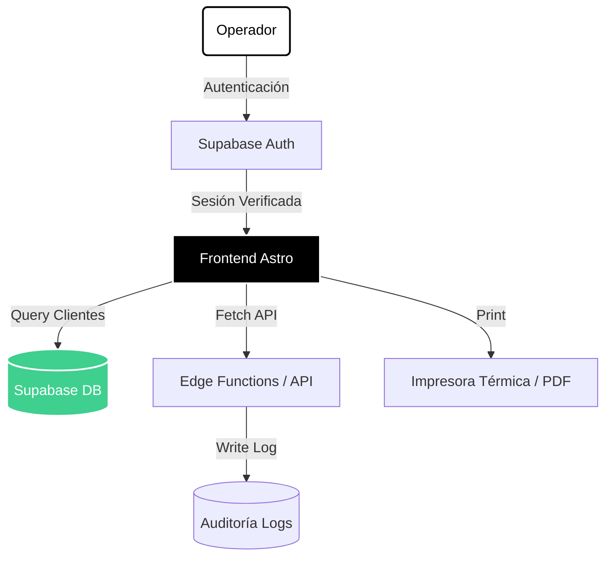

<!-- MACHOTE — README -->

<div align="center">

# ✦ MACHOTE

### Sistema de Etiquetas de Envío — Dream Logistics

[](https://astro.build)
[](https://supabase.com)
[](https://www.typescriptlang.org)
[](https://tailwindcss.com)

*Plataforma interna para generación e impresión de etiquetas de envío.*

---

</div>

## ¿Qué es Machote?

**Machote** es la herramienta interna de **Repuestos Maranata / DREAM** para gestionar e imprimir etiquetas de envío de manera rápida, profesional y sin errores. 

El operador busca el cliente, verifica los datos y manda a imprimir — todo en segundos. El sistema registra automáticamente cada acción en un log de auditoría.

---

## ✦ Características

| Módulo | Descripción |
|---|---|
| 🔐 **Acceso seguro** | Login con autenticación via Supabase Auth. Sesión cifrada en cookie. |
| 🔍 **Búsqueda inteligente** | Busca clientes por nombre o código con autocompletado en tiempo real. |
| 🏷️ **Etiqueta de envío** | Genera e imprime la etiqueta con remitente, destinatario, dirección y teléfono. |
| 👥 **Gestión de clientes** | Alta, edición y búsqueda de clientes desde el panel. |
| 📋 **Registro de auditoría** | Cada impresión queda registrada con usuario, cliente y timestamp. |
| 👤 **Perfil de usuario** | Panel de perfil con nombre e información del operador activo. |

---

## 🏗️ Arquitectura del Sistema



---

## ⚙️ Stack Tecnológico

```
Framework:   Astro 5 (SSR con @astrojs/node)
Base de datos: Supabase (PostgreSQL + Row Level Security)
Estilos:     Tailwind CSS v4
Lenguaje:    TypeScript
Autenticación: Supabase Auth (JWT)
```

---

## 🗂️ Estructura del Proyecto

```
machote/
├── src/
│   ├── pages/
│   │   ├── index.astro        # Login
│   │   ├── machote.astro      # Generador de etiquetas (app principal)
│   │   ├── clientes.astro     # Gestión de clientes
│   │   ├── logs.astro         # Historial de auditoría
│   │   ├── perfil.astro       # Perfil del operador
│   │   └── api/               # Endpoints del servidor
│   ├── layouts/
│   │   └── Layout.astro       # Layout base con nav y estilos globales
│   ├── components/            # Componentes reutilizables
│   ├── lib/                   # Clientes y utilidades (Supabase)
│   ├── styles/
│   │   └── global.css         # Sistema de diseño global
│   └── middleware.ts          # Protección de rutas por sesión
├── public/
│   └── logo.png               # Logo de la empresa
└── astro.config.mjs
```

---

## 🗄️ Base de Datos (Supabase)

El sistema utiliza **Row Level Security (RLS)** para asegurar que solo usuarios autenticados puedan leer o insertar datos.

**Tabla `clientes`**
```sql
id        bigint  -- PK autoincremental
codigo    text    -- Código único del cliente
nombre    text    -- Nombre completo
celular   text    -- Teléfono de contacto
direccion text    -- Dirección de entrega
```

**Tabla `logs`**
```sql
id        bigint  -- PK autoincremental
mensaje   text    -- Registro de la acción (quién, qué cliente, cuándo)
```

---

## 🚀 Instalación y Desarrollo

### 1. Clonar el repositorio

```bash
git clone https://github.com/liledu/enviosdream.git
cd enviosdream
```

### 2. Instalar dependencias

```bash
npm install
```

### 3. Configurar variables de entorno

Crea un archivo `.env.local` en la raíz del proyecto:

```env
PUBLIC_SUPABASE_URL=https://tu-proyecto.supabase.co
PUBLIC_SUPABASE_ANON_KEY=tu_anon_key_aqui
SUPABASE_SERVICE_ROLE_KEY=tu_service_role_key_aqui
```

> ⚠️ **Nunca subas `.env.local` al repositorio.** Ya está en el `.gitignore`.

### 4. Iniciar el servidor de desarrollo

```bash
npm run dev
```

La app estará disponible en `http://localhost:4321`

---

## 🔐 Autenticación

El acceso está protegido por Supabase Auth. El middleware en `src/middleware.ts` redirige cualquier ruta protegida al login si no hay una sesión válida.

**Flujo de acceso:**
1. Usuario introduce sus credenciales en `/`
2. El endpoint `/api/login` autentica contra Supabase
3. Se guarda el token en una cookie `sb:session`
4. El middleware verifica la cookie en cada petición
5. En `/api/logout` se elimina la sesión y se redirige al login

---

## 📄 Licencia

Uso interno — **Repuestos Maranata / DREAM**. Todos los derechos reservados.

---

<div align="center">

Hecho con ♥ para el equipo de ventas de **DREAM**

</div>
